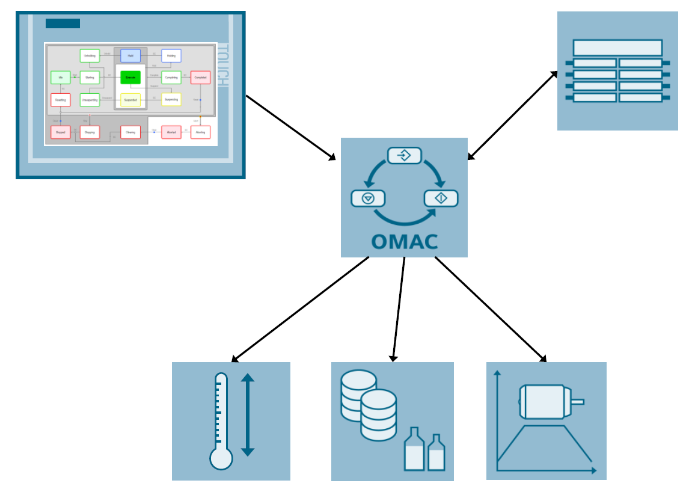
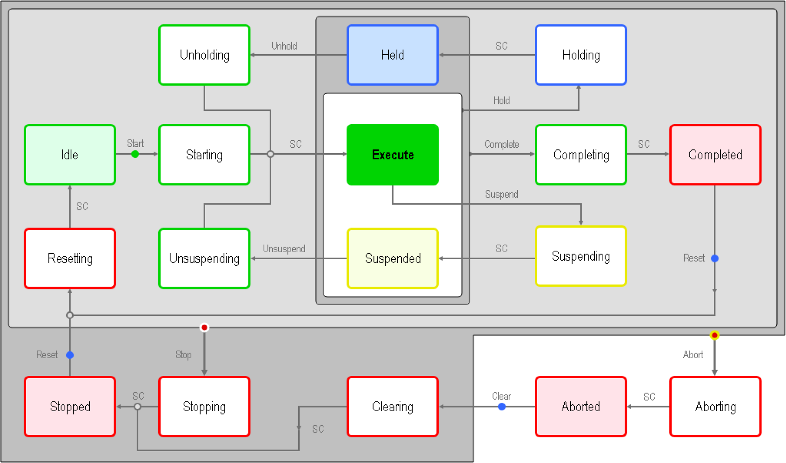
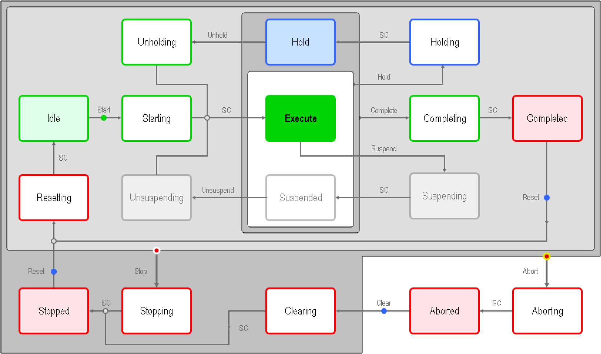

# Library Overview

## Possible user scenario

A production machine consists of different machine modes (e.g. manual or production mode) and states (e.g. stopped or aborting).
The machine state can be controlled with commands (e.g. start or stop).
The library LPMLV2022 provides a standardized mode and state manager to control a machine.
User defined code can be filled in an easy to use structure via importing the source code into the user application directly.

In addition, a machine HMI or an upper level system (MES) can be connected by using the standardized machine interface.

## OMAC Packaging Working Group

### Structure, contents and aim of the OMAC Packaging Working Group

OMAC (The Organization for Machine Automation and Control) is the organization for automation and manufacturing professionals that is dedicated to supporting the machine automation and operation needs of manufacturing.

The OMAC Packaging Working Group was formed as an initiative from big international end users. In the working group, end users, machine manufacturers (OEMs) and controller manufacturers discuss standards for the automation of production machines in order to reduce the range of variants for different products,technologies and applications.

The objective is to achieve significant improvements regarding the following points:

- Delivery time
- Commissioning time
- Machine dimensions
- Machine performance
- Integration capability
- Format change time
- Flexibility
- Machine modularity
- Machine downtime

Within the OMAC Packaging Working Group, the PackML working group is involved with the definition of guidelines and standards to achieve a standard automation software structure.

> NOTE
>
> Knowledge about the contents of the basic OMAC documents is an advantage when it comes to understanding the solutions described in this documentation.
>

### See also

[OMAC website](https://www.omac.org)

## OMAC PackML Guidelines

The major part of the guidelines describes the OMAC mode management (unit mode manager and state machine), see _ISA Technical Report TR88.00.02 Machine and Unit States_.

In addition the PackML [pack tags](./constants/LPMVL2022_PackTagsConstants.md) are listed which are used as standardized variable structures (pack tags) for the cross-machine coupling between machine controllers and to higher-level HMI, MES or Enterprise systems, see also _ISA Technical Report TR88.00.02 Machine and Unit States_.

There exist the following variable structures for the pack tags:

- Command tags, to control and parameterize the machine
- Status tags, to provide information about the machine state
- Administration tags, to provide information about the machine efficiency (OEE data) and machine diagnostics

## Unit Mode and State Manager

The LPMLV2022 library contains a function block for the unit mode and state management according to PackML V2022.

- Unit modes Manual, Maintenance, Production and user-defined modes
- Uniform states within a unit mode  
    Defined states, such as Stopped, Starting, Execute, Aborting, etc. can be used to handle the machine states within an operating mode. Users can individually remove states that are not used in compliance with the OMAC guidelines.

The machine functionality to be executed in the particular modes and states must be programmed by the user for the specific application.

### Modes and states according to PackMLV2022

The _Production_, _Maintenance_, _Manual_ and the user-defined modes with their associated states defined by PackML V2022 are listed in this section. The state machines of the _Manual_, _Maintenance_ and the user-defined modes are typically a subset of the state machine of the _Production_ mode. Which states are used in the individual modes is not standardized and users can define them as required. The state model for the _Production_ mode should be considered as the maximum quantity structure, which can be reduced, but should not be increased. This means that the state machine of the _Production_ mode is always used and for smaller quantity structures, individual states are directly run-through or skipped.

Example of a state machine for the _Production_ mode

Exmaple of a state machine for the _Maintenance_ mode

## Unit Modes

| Number | UnitMode |  Description |
|--------|----------|--------------|
| 0 | Invalid | Not a valid unit mode |
| 1 | Production | This represents the mode which is utilized for routine production. The machine executes relevant logic in response to commands which are either entered directly by the operator or issued by another supervisory system. |
| 2 | Maintenance | This mode may allow suitably authorized personnel the ability to run an individual machine independent of other machines in a production line. This mode would typically be used for fault finding, machine trials or testing operational improvements. This mode would also allow the speed of the machine to be adjusted (where this feature is available). |
| 3 | Manual | This provides direct control of individual machine modules. This feature is available depending upon the mechanical constraints of the mechanisms being exercised. This feature may be used for the commissioning of individual drives, verifying the operation of synchronized drives, testing the drive as a result of modifying parameters etc. |
| 4-31 | UserMode01 .. UserMode28 |The requirements for user-defined unit modes differ depending on the machine and application. A typical user-defined unit mode is, for example, a cleaning mode. |

## States

| Number | State | Description |
|--------|-------|-------------|
| 0 | Undefined | Not a valid state. |
| 1 | Clearing | **State Type: Acting** Initiated by a Clear command to clear faults that may have occurred and are present in the Aborted state before proceeding to a Stopped state. |
| 2 | Stopped | **State Type: Wait** The machine is powered and stationary after completing the Stopping state. All communications with other systems are functioning (if applicable). A Reset command will cause a transition from Stopped to the Resetting state. |
| 3 | Starting | **State Type: Acting** The machine completes the steps needed to start. This state is entered as a result of a Start command (local or remote). When Starting completes, the machine will transition to the Execute state. |
| 4 | Idle | **State Type: Wait** This is the state that indicates that Resetting is complete. The machine will maintain the conditions that were achieved during the Resetting state, and perform operations required when the machine is in Idle. |
| 5 | Suspended | **State Type: Wait** Refer to Suspending for when this state is used. In this state the machine does not produce product. It will either stop running or continue to cycle without producing until external process conditions return to normal, at which time, the Suspended state will transition to the Unsuspending state, typically without any operator intervention. |
| 6 | Execute | **State Type: Acting** Once the machine is processing materials it is in the Execute state until a transition command is received. Different machine modes will result in specific types of Execute activities. For example, if the machine is in the "Production" mode, the Execute will result in products being produced, while perhaps in a user-defined "Clean Out" mode the Execute state would result in the action of cleaning the machine. |
| 7 | Stopping | **State Type: Acting** This state is entered in response to a Stop command. While in this state the machine executes the logic that brings it to a controlled stop as reflected by the Stopped state. Normal Starting of the machine cannot be initiated unless Resetting has taken place. |
| 8 | Aborting | **State Type: Acting** The Aborting state can be entered at any time in response to the Abort command, typically triggered by the occurrence of a machine event that warrants an aborting action. The aborting logic will bring the machine to a rapid safe stop. |
| 9 | Aborted | **State Type: Wait** The machine maintains status information relevant to the abort condition. The machine can only exit the Aborted state after an explicit Clear command, subsequent to manual intervention to correct and reset the detected machine faults. |
| 10 | Holding | **State Type: Acting** This state is used when internal (inside this unit/machine and not from another machine on the production line) machine conditions do not allow the machine to continue producing, that is, the machine leaves the Execute or Suspended states due to internal conditions. This is typically used for routine machine conditions that require minor operator servicing to continue production. This state can be initiated automatically or by an operator and can be easily recovered from. An example of this would be a machine that requires an operator to periodically refill a glue dispenser or carton magazine and due to the machine design, these operations cannot be performed while the machine is running. Since these types of tasks are normal production operations, it is not desirable to go through aborting or stopping sequences, and because these functions are integral to the machine they are not considered to be "external". While in the Holding state, the machine is typically brought to a controlled stop and then transitions to Held upon state complete. To be able to restart production correctly after the Held state, all relevant process set points and return status of the procedures at the time of receiving the Hold command must be saved in the machine controller when executing the Holding procedure. |
| 11 | Held | **State Type: Wait** Refer to Holding for when this state is used. In this state the machine does not produce product. It will either stop running or continue to dry cycle. A transition to the Unholding state will occur when internal machine conditions change or an Unhold command is initiated by an operator. |
| 12 | Unholding | **State Type: Acting** Refer to Holding for when this state is used. A machine will typically enter into Unholding automatically when internal conditions, material levels, for example, return to an acceptable level. If an operator is required to perform minor servicing to replenish materials or make adjustments, then the Unhold command may be initiated by the operator. |
| 13 | Suspending | **State Type: Acting** This state is used when external (outside this unit/machine but usually on the same integrated production line) process conditions do not allow the machine to continue producing, that is, the machine leaves Execute due to upstream or downstream conditions on the line. This is typically due to a Blocked or Starved event. This condition may be detected by a local machine sensor or based on a supervisory system external command. While in the Suspending state, the machine is typically brought to a controlled stop and then transitions to Suspended upon state complete. To be able to restart production correctly after the Suspended state, all relevant process set points and return status of the procedures at the time of receiving the Suspend command must be saved in the machine controller when executing the Suspending procedure. |
| 14 | Unsuspending | **State Type: Acting** Refer to Suspending for when this state is used. This state is a result of process conditions returning to normal. The Unsuspending state initiates any required actions or sequences necessary to transition the machine from Suspended back to Execute. To be able to restart production correctly after the Suspended state, all relevant process set points and return status of the procedures at the time of receiving the Suspend command must be saved in the machine controller when executing the Suspending procedure. |
| 15 | Resetting | **State Type: Acting** This state is the result of a Reset command from the Stopped or Completed state. Faults and stop causes are reset. Resetting will typically cause safety devices to be energized and place the machine in the Idle state where it will wait for a Start command. No hazardous motion should happen in this state. |
| 16 | Completing | **State Type: Acting** This state is the result of a Complete command from the Execute, Held or Suspended states. The Complete command may be internally generated, such as reaching the end of a predefined production count where normal operation has run to completion, or externally generated, such as by a supervisory system. The Completing state is often used to end a production run and summarize production data. |
| 17 | Completed | **State Type: Wait** The machine has finished the Completing state and is now waiting for a Reset command before transitioning to the Resetting state. |

## Control commands

| Number | Description |
|--------|-------------|
|0 | Undefined |
|1 | Reset |
|2 | Start |
|3 | Stop |
|4 | Hold |
|5 | Unhold |
|6 | Suspend |
|7 | Unsuspend |
|8 | Abort |
|9 | Clear |
|10 | Complete |

## Unit mode transitions

### Permitted change of the unit mode

Changing the unit mode is permitted in any state and can be configured in the configuration (`config.ModeTransitionCfg`). Typically, the following wait states are used for unit mode changes: `Stopped`, `Idle`, `Aborted`. The unit mode change is only possible if the state also exists in the requested unit mode.

## State transitions

### State Change with Priority Assignment

The following table shows the state transitions with command priorities. Commands further to the right have higher priority for state changes.

|  |  |  |  | **State Commands** |  |  |  |  |  |  | **State** **Complete** |
|---|---|---|---|---|---|---|---|---|---|---|---|
| **Current State** | **Start** | **Reset¹** | **Hold** | **Unhold** | **Suspend** | **Unsuspend** | **Complete** | **Clear¹** | **Stop²** | **Abort²** |  |
| **IDLE** | STARTING |  |  |  |  |  |  |  | STOPPING | ABORTING |  |
| **STARTING** |  |  |  |  |  |  |  |  | STOPPING | ABORTING | EXECUTE |
| **EXECUTE** |  |  | HOLDING |  | SUSPENDING |  | COMPLETING |  | STOPPING | ABORTING |  |
| **COMPLETING** |  |  |  |  |  |  |  |  | STOPPING | ABORTING | COMPLETED |
| **COMPLETED** |  | RESETTING |  |  |  |  |  |  | STOPPING | ABORTING |  |
| **RESETTING** |  |  |  |  |  |  |  |  | STOPPING | ABORTING | IDLE |
| **HOLDING** |  |  |  |  |  |  |  |  | STOPPING | ABORTING | HELD |
| **HELD** |  |  |  | UNHOLDING |  |  | COMPLETING |  | STOPPING | ABORTING |  |
| **UNHOLDING** |  |  |  |  |  |  |  |  | STOPPING | ABORTING | EXECUTE |
| **SUSPENDING** |  |  |  |  |  |  |  |  | STOPPING | ABORTING | SUSPENDED |
| **SUSPENDED** |  |  | HOLDING |  |  | UNSUSPENDING | COMPLETING |  | STOPPING | ABORTING |  |
| **UNSUSPENDING** |  |  |  |  |  |  |  |  | STOPPING | ABORTING | EXECUTE |
| **STOPPING** |  |  |  |  |  |  |  |  |  | ABORTING | STOPPED |
| **STOPPED** |  | RESETTING |  |  |  |  |  |  |  | ABORTING |  |
| **ABORTING** |  |  |  |  |  |  |  |  |  |  | ABORTED |
| **ABORTED** |  |  |  |  |  |  |  | CLEARING |  |  |  |
| **CLEARING** |  |  |  |  |  |  |  |  |  | ABORTING | STOPPED |

**Notes:**

1. It is common practice for Clear and Reset to be initiated using the same physical operator interface device.
2. It is common practice in packaging (but not process) applications to permit use of Stop and Abort commands while in the IDLE, COMPLETED, STOPPED, and RESETTING states.
